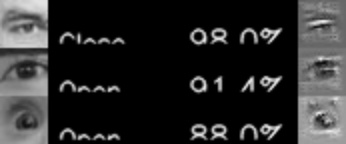

# pytorch-eyeblink-detection
Simple Eye Blink Detection with CNN

* Using Mini Xception 
* Model size is about `230KB`

## Trained Model

Trained by [CEW](http://parnec.nuaa.edu.cn/xtan/data/ClosedEyeDatabases.html) dataset.

* Validation Accuracy : 96.7%
* Validation Loss : 0.1256

Here is the result of sample image.  
| Image | Open Probability | Guided Backprop | Grad-Cam | Guided Grad-Cam



## Retrain

```
cd src
python train.py
python check.py  #check.py supports cpu only
```

## Reference

* [pytorch-facial-expression-recognition](https://github.com/yoshidan/pytorch-facial-expression-recognition)

